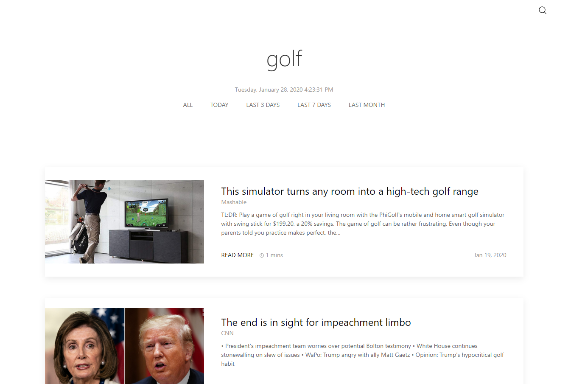

# News Api Angular App

This project was generated with [Angular CLI](https://github.com/angular/angular-cli) version 8.3.21.

> View Live: [News API App](https://hushed-wall.herokuapp.com/main-view)

## About
This project uses [News API](https://newsapi.org/) to retreive relavant articles. There are two different types of search that this app can handle. One is by keyword and the other is by category. The articles are displayed in a list along with summarizing details about each. This app was created with [UIkit](https://getuikit.com/) framework. 

## Estimated Reading Time
The reading time that accompanies each article listing is roughly estimated based on the number of characters that are in the article. Estimated reading time is based on character count which is provided by the API.

## Display
#### Search Types

#### Results

## Resources
- [Deploying an Angular app to Heroku](https://itnext.io/how-to-deploy-angular-application-to-heroku-1d56e09c5147)
- [Setting environment variables from `.env` files](https://medium.com/@ferie/how-to-pass-environment-variables-at-building-time-in-an-angular-application-using-env-files-4ae1a80383c)
- [Understanding environment variables node](https://www.twilio.com/blog/2017/08/working-with-environment-variables-in-node-js.html)
- [dotenv](https://medium.com/@thejasonfile/using-dotenv-package-to-create-environment-variables-33da4ac4ea8f)
- [config vars in Heroku](https://devcenter.heroku.com/articles/config-vars)

 

